<picture>
  <source media="(prefers-color-scheme: dark)" srcset="assets/header-dark.svg">
  <source media="(prefers-color-scheme: light)" srcset="assets/header-light.svg">
  
</picture>

  
  
  
  

<picture>
  <source media="(prefers-color-scheme: dark)" srcset="assets/divider-dark.svg">
  
</picture>

### Hey 👋, I'm Abhishek

I'm a full-stack developer at **Global Matrix Solution**, based in 📍 **Meerut, India**. I build
web apps that are **functional, clean and useful in real life**: backend logic, dashboards, APIs
and database design. Lately I've been shipping **healthcare and AI tools** to production with
Laravel, React, FastAPI and Docker.

  
  
  

☕ *Don't forget to commit your code and drink some water.* ☕

### ⚡ A few quick facts

- 🔭 Currently building [**OPD Scan QC**](https://ipdscan.subharti.org/), quality control for scanned hospital records.
- 🩺 Also shipped an **AI scribe** for doctors and an **AI co-drafting** tool for legal teams.
- 🧐 Learning **React + Laravel integration**, **Docker deployments** and **FastAPI**.
- 💬 Ask me about **Laravel, REST APIs, dashboards and getting things deployed**.
- 🤝 Open to **freelance work and interesting projects**.
- 📫 Reach me at [abhichauhan200504@gmail.com](mailto:abhichauhan200504@gmail.com).
- 🎉 Fun fact: every animation on this page is hand-written SVG. No JavaScript allowed here.

 

### ✦ Featured work

  <a href="https://ipdscan.subharti.org/">
    <picture>
      <source media="(prefers-color-scheme: dark)" srcset="assets/card-opd-scan-dark.svg">
      
    </picture>
  </a>
  <picture>
    <source media="(prefers-color-scheme: dark)" srcset="assets/card-opd-scribe-dark.svg">
    
  </picture>
  <picture>
    <source media="(prefers-color-scheme: dark)" srcset="assets/card-ilms-dark.svg">
    
  </picture>
  <a href="https://proseoaudittool.com/medi/">
    <picture>
      <source media="(prefers-color-scheme: dark)" srcset="assets/card-medi-dark.svg">
      
    </picture>
  </a>

<b>More projects</b>

 

| Project | What I built | Tech |
|---|---|---|
| **Skills360.ai** | Job platform with dashboards, resume builder and matching filters | Laravel, Tailwind, JS |
| **InvoicePro** | Invoicing and expense tracking with PDF download | Laravel, Tailwind |

### ✦ Tech stack

  <picture>
    <source media="(prefers-color-scheme: dark)" srcset="https://skillicons.dev/icons?i=laravel%2Cphp%2Cmysql%2Cjs%2Cts%2Creact%2Ctailwind%2Cpython%2Cfastapi%2Cdocker&theme=dark&perline=10">
    
  </picture>
    
  <picture>
    <source media="(prefers-color-scheme: dark)" srcset="https://skillicons.dev/icons?i=git%2Cgithub%2Cpostman%2Clinux%2Cvscode%2Cfigma%2Cnginx%2Credis%2Cpostgres&theme=dark&perline=10">
    
  </picture>

<b>What I can build</b>

 

- Authentication, roles and permissions, and admin dashboards
- REST APIs for web and mobile apps
- ERP-style CRUD systems with reports and PDF and Excel exports
- AI features (OCR, speech-to-text, LLM drafting) wired into real workflows
- Responsive UIs from Figma, with clean folder structure and optimised queries
- Docker deployments with nginx, Postgres and Redis

<b>Currently improving</b>

 

- Cleaner, reusable backend architecture
- React and Laravel integration
- Production deployments: Docker, CI and monitoring
- Contributing to open source when I can

<picture>
  <source media="(prefers-color-scheme: dark)" srcset="assets/divider-dark.svg">
  
</picture>

### ✦ GitHub activity

  <picture>
    <source media="(prefers-color-scheme: dark)" srcset="https://github-readme-stats.vercel.app/api?username=abh1shxkk&show_icons=true&theme=transparent&hide_border=true&title_color=7c5cff&icon_color=22d3ee&text_color=c9d1d9">
    
  </picture>
  <picture>
    <source media="(prefers-color-scheme: dark)" srcset="https://github-readme-stats.vercel.app/api/top-langs/?username=abh1shxkk&layout=compact&theme=transparent&hide_border=true&title_color=7c5cff&text_color=c9d1d9&langs_count=6">
    
  </picture>

  <picture>
    <source media="(prefers-color-scheme: dark)" srcset="https://streak-stats.demolab.com?user=abh1shxkk&theme=transparent&hide_border=true&ring=7c5cff&fire=22d3ee&currStreakLabel=7c5cff&sideLabels=c9d1d9&currStreakNum=e6edf3&sideNums=e6edf3&dates=8b949e&stroke=30363d">
    
  </picture>

  <picture>
    <source media="(prefers-color-scheme: dark)" srcset="https://raw.githubusercontent.com/abh1shxkk/abh1shxkk/output/github-contribution-grid-snake-dark.svg">
    
  </picture>

  I like learning by building. If you're working on something interesting, <a href="mailto:abhichauhan200504@gmail.com">say hi</a>.

