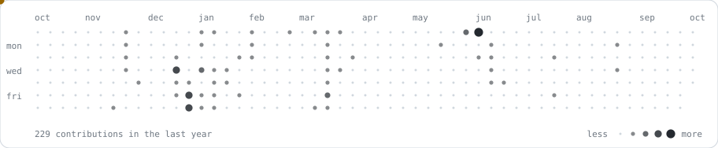

<picture>
  <source media="(prefers-color-scheme: dark)" srcset="assets/card-dark.svg">
  
</picture>

  <a href="https://portfolio-frontend-sigma-jade.vercel.app/">portfolio</a> ·
  <a href="https://linkedin.com/in/abhishek-chauhan-880496394">linkedin</a> ·
  <a href="https://x.com/abh1shxkk">x</a> ·
  <a href="mailto:abhichauhan200504@gmail.com">email</a>

#### selected work

| project | what it does | live | code |
|---|---|---|---|
| **OPD Scan QC** | quality control for scanned hospital records: OpenCV page checks, AI transcription, human review | [ipdscan.subharti.org](https://ipdscan.subharti.org/) | private |
| **OPD Scribe** | turns doctor and patient conversations in Indian languages into transcripts and SOAP notes | [opd-scribe](https://opd-scribe.54-173-64-109.sslip.io) | private |
| **ILMS** | legal case management: matters, notices, contracts and RTI, with AI co-drafting | [ilms](https://ilms.54-173-64-109.sslip.io) | private |
| **Medi BillSuite** | pharma distribution ERP: GST invoicing, batch and expiry tracking, 50+ reports | [medi](https://proseoaudittool.com/medi/) | private |
| **Skills360** | job platform where users post and apply for jobs, with user and admin dashboards | [skills360.ai](https://www.skills360.ai/) | private |
| **DelWell** | mindful dating platform: self-discovery quizzes, compatibility scoring, personalised matching | [hellodelwell.com](https://hellodelwell.com/) | private |
| **DolceVitale** | WooCommerce store for premium wellness products | [dolcevitale.com](https://dolcevitale.com/) | private |
| **Kairo Global** | custom WordPress site for an immigration services company | [kairoglobal.co.in](https://kairoglobal.co.in/) | private |
| **Dotify** | Gmail dot-variation generator for filtering and tracking signups | [dotify-one.vercel.app](https://dotify-one.vercel.app) | [repo](https://github.com/Abh1shxkk/dotify) |
| **InvoicePro** | invoicing, expenses and PDF export with roles and a REST API | | [repo](https://github.com/Abh1shxkk/invoiceprowebapp) |
| **Portfolio** | React + Laravel portfolio with an admin dashboard | [onrender](https://abhishek-portfolio-kfdk.onrender.com) | [repo](https://github.com/Abh1shxkk/abhishek-portfolio) |

#### last year, one dot per day

<picture>
  <source media="(prefers-color-scheme: dark)" srcset="assets/grid-dark.svg">
  
</picture>

stats rebuild daily via <a href=".github/workflows/build.yml">a workflow</a> · everything here is hand-written svg
